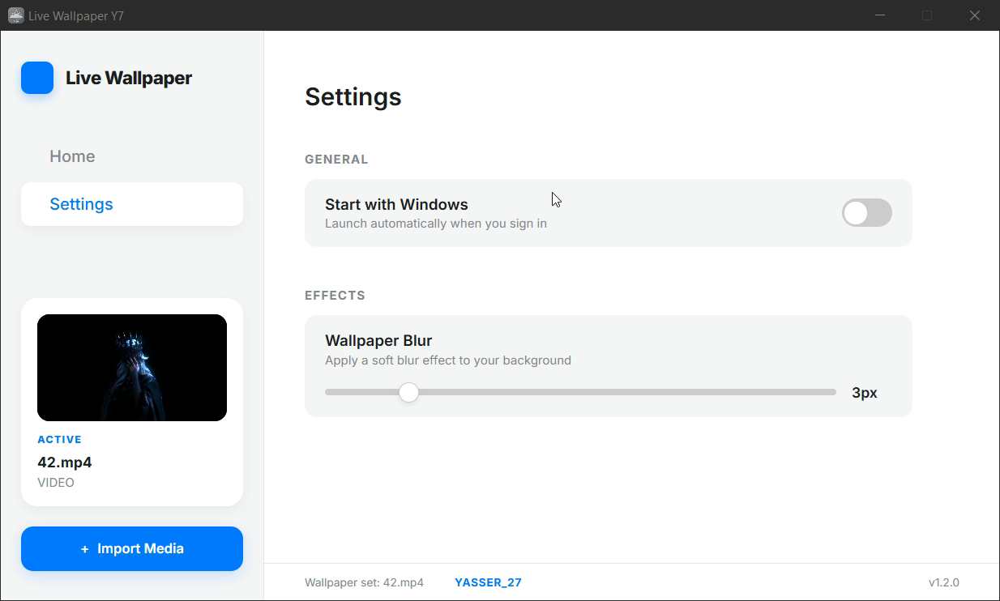
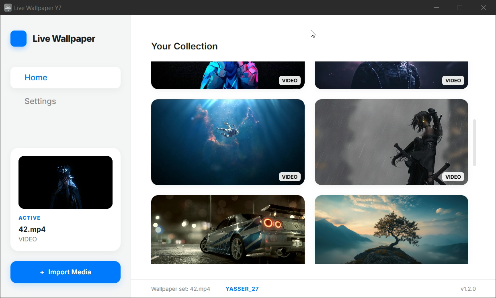

  

# Live Wallpaper

## Description
Make desktop Screen Come Alive with LIve Wallpaper Desktop
> [!NOTE]

> Find video and wallpaper  

> %AppData%\Live Wallpaper\live

> Live Wallpaper Faster and use 1% CPU Only

## Screenshots

| Image | Image |
|---|---|
|  |  |

---

### Download [Live Wallpaper 93Mb](https://github.com/YASSER-27/LIve-Wallpaper-Desktop/releases/download/1.2.0/Live.Wallpaper.Setup.1.2.0.exe)

### Download [Live Wallpaper 909Mb](https://github.com/YASSER-27/LIve-Wallpaper-Desktop/releases/download/1.2.0/Live.Wallpaper.Setup.1.2.1.exe)

# `Video`

https://github.com/user-attachments/assets/9cb96cb9-2925-4dfd-9b8c-618faa42250e

---

### Author
**YASSER-27** - [GitHub](https://github.com/YASSER-27/)

